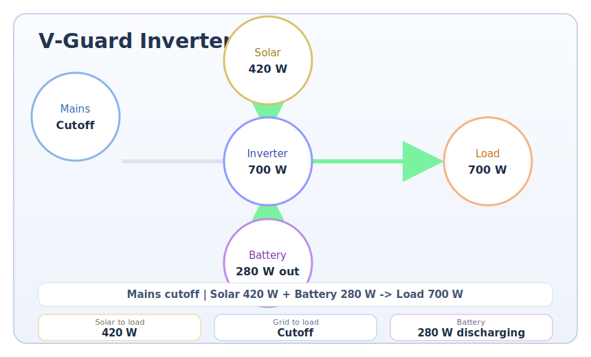

# Custom Flow Card

Custom Lovelace card for Home Assistant that visualizes inverter power flow in an Energy Dashboard style.

Works well for setups like:

- Grid input power from Shelly device
- Inverter output power from Shelly device
- Battery and solar telemetry from BLE -> ESP32 -> MQTT sensors

## Preview

Yes, the flow rendering is SVG-based inside the card.



## HACS Installation

1. Push this repo to GitHub.
2. In Home Assistant, go to HACS -> Frontend -> Custom repositories.
3. Add your repository URL and category **Dashboard**.
4. Install **Custom Flow Card**.
5. Restart Home Assistant (or reload resources).

The card JS is served from:

- `/hacsfiles/custom-flow-card/custom-flow-card.js`

## Manual Resource (if needed)

In Settings -> Dashboards -> Resources, add:

- URL: `/hacsfiles/custom-flow-card/custom-flow-card.js`
- Type: `JavaScript Module`

## Example Card Config (Your Sensors)

```yaml
type: custom:custom-flow-card
title: V-Guard Inverter Flow
entities:
  grid_power: sensor.inverter_in_1_power
  inverter_output_power: sensor.inverter_out_power
  load_power: sensor.inverter_out_power
  battery_percent: sensor.v_guard_inverter_battery_percentage
  battery_voltage: sensor.v_guard_inverter_battery_voltage
  solar_current: sensor.v_guard_inverter_solar_current
  mains_voltage: sensor.v_guard_inverter_mains_voltage
icons:
  grid: mdi:transmission-tower
  inverter: mdi:power
  battery: mdi:battery
  home: mdi:home-lightning-bolt
  solar: mdi:solar-power
```

## UI-Based Configuration

This card now supports visual editor configuration in Lovelace UI mode.

In **Edit Dashboard -> Add Card -> Custom: Custom Flow Card**, you can set:

- Card title
- Grid / inverter / load / solar / battery entities
- Details strip entities (today energy, temperature, cuts, BLE status)

You can still use YAML for advanced keys like custom icons.

## Entity Mapping

- `entities.grid_power` (required): Power from grid side (W or kW).
- `entities.inverter_output_power` (required): Inverter output power (W or kW).
- `entities.load_power` (optional): Load power shown at home node.
- `entities.solar_power` (optional): Direct solar power sensor in W/kW.
- `entities.solar_current` + `entities.mains_voltage` (optional): if `solar_power` is absent, card estimates solar power using `current * voltage`.
- `entities.battery_percent` (optional): Battery percentage label and icon.
- `entities.battery_voltage` (optional): Extra battery metric label.
- `entities.details_today_energy` (optional): Details strip item, output energy today.
- `entities.details_grid_energy` (optional): Details strip item, grid energy today.
- `entities.details_temperature` (optional): Details strip item, inverter/system temperature.
- `entities.details_power_cuts_today` (optional): Details strip item, power cut count.
- `entities.details_ble_status` (optional): Details strip item, BLE connectivity state.

## Notes

- Card supports positive and negative power direction on grid line.
- Battery flow direction is inferred from power balance.
- `kW` values are automatically converted to `W` internally.